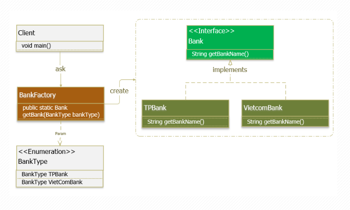
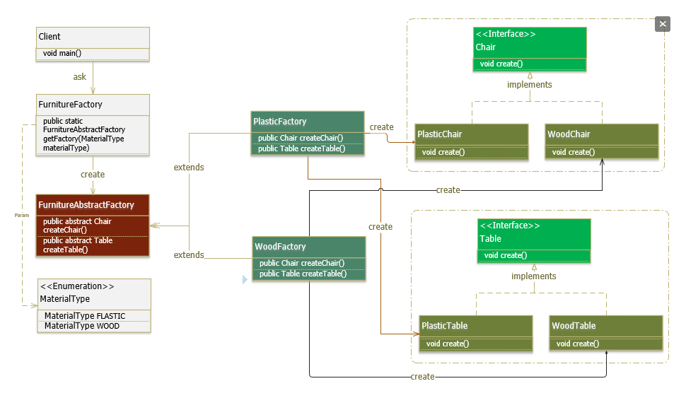
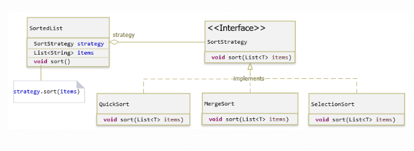
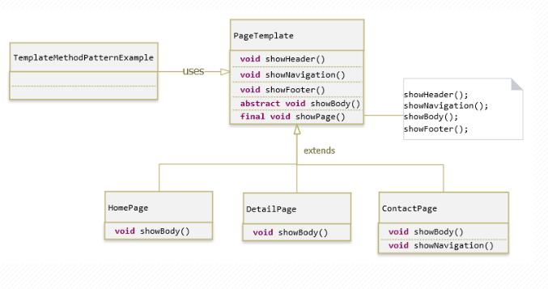
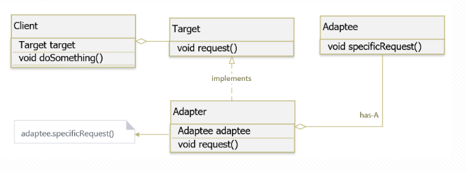
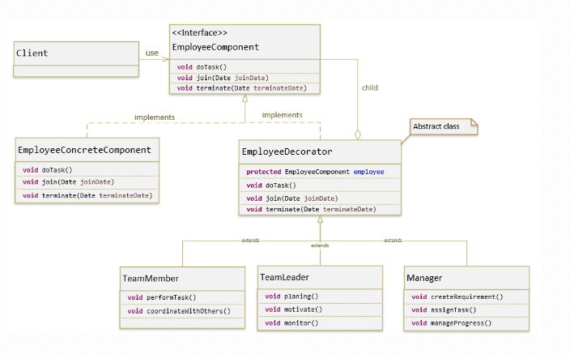

# Creational Pattern
   - Patterns of this type provide a solution to create objects and hide the logic of its creation instead of creating the object directly (using the new keyword). This makes the program more flexible in deciding which objects should be created in different situations.
   - Các patterns loại này cung cấp giải pháp để tạo ra các đối tượng và che giấu được logic của việc tạo ra nó thay vì tạo ra đối tượng theo cách trực tiếp (sử dụng từ khoá new). Điều này giúp chương trình trở nên mềm dẻo hơn trong việc quyết định đối tượng nào cần được tạo ra trong những tình huống khác nhau.
1. Factory Pattern
   - Factory Method Design Pattern or Factory Pattern for short is one of the Patterns in the Creational Design Pattern group. Factory Pattern's job is to manage and return objects on demand, making object initialization more flexible.
   - Factory Method Design Pattern hay gọi ngắn gọn là Factory Pattern là một trong những Pattern thuộc nhóm Creational Design Pattern. Nhiệm vụ của Factory Pattern là quản lý và trả về các đối tượng theo yêu cầu, giúp cho việc khởi tạo đổi tượng một cách linh hoạt hơn.
   
2. Abstract Factory Pattern
   - The Abstract Factory pattern is one of the Creational patterns. It is a method of creating a Super-factory used to create other factories. Also known as the Factory of the Factory. Abstract Factory Pattern is a higher level Pattern than Factory Method Pattern.
   - Abstract Factory pattern là một trong những Creational pattern. Nó là phương pháp tạo ra một Super-factory dùng để tạo ra các Factory khác. Hay còn được gọi là Factory của các Factory. Abstract Factory Pattern là một Pattern cấp cao hơn so với Factory Method Pattern.
   image.png
# Behavioral Pattern
   - This group is concerned with behavioral relationships to handle functions between objects in the system. For samples belonging to this group, we can rely on collaboration and sequence diagram to track.
   - Nhóm này liên quan đến các quan hệ hành vi để xử lí các chức năng giữa các đối tượng trong hệ thống. Đối với các mẫu thuộc nhóm này ta có thể dựa vào collaboration và sequence diagram để theo dõi.
1. Strategy pattern
   - The Strategy Pattern is one of the Behavior Patterns. It allows defining a set of algorithms, encapsulating each algorithm, and making it easy to dynamically change the algorithms within the object. Strategy allows algorithms to transform independently as the user uses them.
   - Strategy Pattern là một trong những Pattern thuộc nhóm hành vi (Behavior Pattern). Nó cho phép định nghĩa tập hợp các thuật toán, đóng gói từng thuật toán lại, và dễ dàng thay đổi linh hoạt các thuật toán bên trong object. Strategy cho phép thuật toán biến đổi độc lập khi người dùng sử dụng chúng.
   
2. Template Method Pattern
   - Template Method Pattern is one of the Patterns belonging to the Behavioral Group (Behavior Pattern). This pattern says that “Define a structure of an algorithm in a function, delegating its implementation to subclasses. The Template Method pattern allows subclasses to redefine the implementation of an algorithm, without having to change the algorithm's structure.
   - Template Method Pattern là một trong những Pattern thuộc nhóm hành vi (Behavior Pattern). Pattern này nói rằng “Định nghĩa một bộ khung của một thuật toán trong một chức năng, chuyển giao việc thực hiện nó cho các lớp con. Mẫu Template Method cho phép lớp con định nghĩa lại cách thực hiện của một thuật toán, mà không phải thay đổi cấu trúc thuật toán“.
   
# Structural Pattern
   - Patterns of this type are related to the class and the members of the object. It is used to establish and define relationships between objects. The larger the system, the more important this pattern plays. We can rely on the class diagram to follow this pattern.
   - Những patterns loại này liên quan tới class và các thành phần của đối tượng. Nó dùng để thiết lập, định nghĩa quan hệ giữa các đối tượng. Hệ thống càng lớn thì mẫu này càng đóng vai trò quan trọng. Ta có thể dựa vào class diagram để theo dõi mẫu này.
1. Adapter Pattern
   - Adapter Pattern (Converter) is one of the Patterns belonging to the structural group (Structural Pattern). The Adapter Pattern allows unrelated interfaces to work together. The object that helps to connect the interfaces is called Adapter.
   - Adapter Pattern (Người chuyển đổi) là một trong những Pattern thuộc nhóm cấu trúc (Structural Pattern). Adapter Pattern cho phép các inteface (giao diện) không liên quan tới nhau có thể làm việc cùng nhau. Đối tượng giúp kết nối các interface gọi là Adapter.
   
2. Decorator Pattern
   - Decorator pattern is one of the Patterns belonging to the structural group (Structural Pattern). It allows users to add new functionality to an existing object without affecting other objects. This type of design has a structure that acts as a wrapper for an existing class. Every time a new feature is needed, the existing object is wrapped in a new object (decorator class).
   - Decorator pattern là một trong những Pattern thuộc nhóm cấu trúc (Structural Pattern). Nó cho phép người dùng thêm chức năng mới vào đối tượng hiện tại mà không muốn ảnh hưởng đến các đối tượng khác. Kiểu thiết kế này có cấu trúc hoạt động như một lớp bao bọc (wrap) cho lớp hiện có. Mỗi khi cần thêm tính năng mới, đối tượng hiện có được wrap trong một đối tượng mới (decorator class).
   